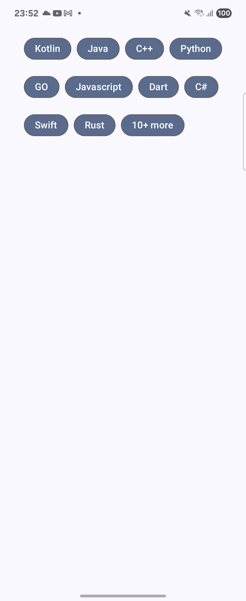
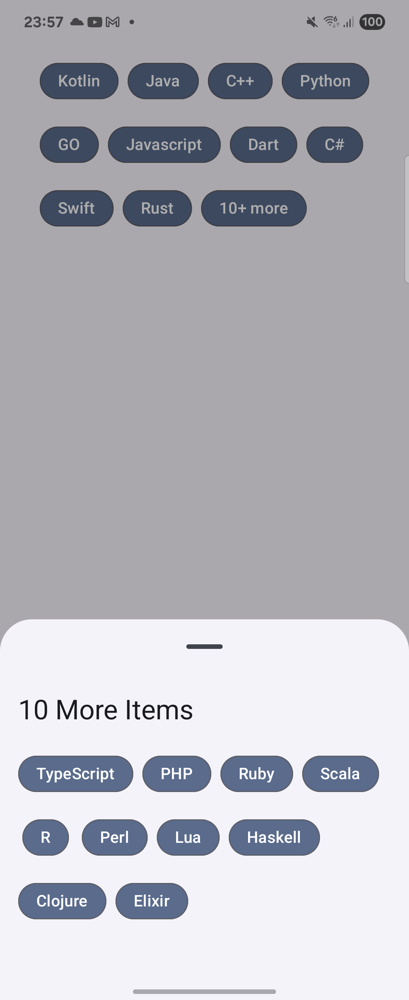

This is a Kotlin Multiplatform project targeting Android, iOS.

* `/composeApp` is for code that will be shared across your Compose Multiplatform applications.
  It contains several subfolders:
  - `commonMain` is for code that’s common for all targets.
  - Other folders are for Kotlin code that will be compiled for only the platform indicated in the folder name.
    For example, if you want to use Apple’s CoreCrypto for the iOS part of your Kotlin app,
    `iosMain` would be the right folder for such calls.

* `/iosApp` contains iOS applications. Even if you’re sharing your UI with Compose Multiplatform,
  you need this entry point for your iOS app. This is also where you should add SwiftUI code for your project.


Learn more about [Kotlin Multiplatform](https://www.jetbrains.com/help/kotlin-multiplatform-dev/get-started.html)

# ContextualFlowRow Sample

A **Jetpack Compose** implementation of a contextual flow layout with overflow handling, built as a replacement for the deprecated `ContextualFlowRow` component. This sample demonstrates how to create a smart, responsive layout that automatically shows a "**X+ more**" chip when content overflows.

## 📖 **Caveat**
This solution uses `Layout` and composes all list items, irrespective of whether they'll be displayed or not.
Because this implementation does not rely on `SubComposeLayout`, it becomes more performant for shorter lists, which is typically the use case for chip arrangements like the one portrayed in the example.
As the list grow the more we could've benefited from using an implementation that leverages `SubComposeLayout` to avoid composing all items straight away.

> 🚨 **Why this exists**: With the deprecation of official flow components, this sample provides a production-ready alternative with enhanced overflow management.

## ✨ **Features**

- 🎯 **Smart Overflow Detection** - Automatically detects when items don't fit
- 📱 **Responsive Layout** - Adapts to different screen sizes and orientations
- 🔢 **Dynamic Counting** - Shows exact number of hidden items
- 📋 **Bottom Sheet Integration** - Expandable view for remaining items
- 🎨 **Customizable Styling** - Flexible theming and spacing options
- 🧩 **Decoupled Architecture** - Reusable components with clean separation

## 📱 **Demo**

| Main View | Bottom Sheet |
|-----------|--------------|
|  |  |

*Sample showing programming languages with overflow handling*

## 🛠 **Implementation Overview**

### **Core Algorithm**

The `ContextualFlowRow` uses a custom `Layout` composable that implements a sophisticated measurement algorithm:

```kotlin
@Composable
fun <T> ContextualFlowRow(
    items: List<T>,
    maxLines: Int = Int.MAX_VALUE,
    onMoreClick: (List<T>) -> Unit = {},
    itemContent: @Composable (T) -> Unit,
)
```

### **Key Algorithmic Components**

#### 1. **Template Chip Measurement**
```kotlin
// Create a template "99+ more" chip for width calculation
AssistChip(
    onClick = { },
    label = { Text("99+ more") },
    // ... styling
)
```
The algorithm pre-measures a template chip to reserve space for the overflow indicator, ensuring consistent layout behavior.

#### 2. **Layout Calculation Engine**
```kotlin
private fun <T> calculateLayout(
    items: List<T>,
    placeables: List<Placeable>,
    moreChipWidth: Int,
    maxWidth: Int,
    maxLines: Int,
    spacing: Int,
    verticalSpacing: Int,
): LayoutResult
```

**The algorithm works in phases:**

**Phase 1: Greedy Item Placement**
- Places items left-to-right, top-to-bottom
- Tracks current position `(currentX, currentY)`
- Moves to next line when width exceeded

**Phase 2: Overflow Detection**
- When reaching `maxLines`, checks if more items exist
- Calculates space needed for "X+ more" chip
- Removes items from current line until chip fits

**Phase 3: Smart Backtracking**
```kotlin
// If "more" chip doesn't fit, remove items from current line
while (currentX + moreChipWidth > maxWidth && lineItems.isNotEmpty()) {
    val removedItem = lineItems.removeLast()
    currentX -= (removedItem.width + spacing)
    removedFromLine++
}
```

#### 3. **Dynamic Count Calculation**
```kotlin
val remainingCount = maxOf(0, items.size - visibleItemsCountRef.intValue)
Text("$remainingCount+ more")
```

## 🏗 **Architecture**

### **Component Separation**

```
┌─────────────────────┐    ┌─────────────────────┐    ┌─────────────────────────────────┐
│   ContextualFlowRow │───▶│ RemainingItemsModal │───▶│ RemainingItemsModalBottomSheet- │
│                     │    │   BottomSheet       │    │            Content              │
│ • Layout Logic      │    │ • Modal Management  │    │ • Content Display               │
│ • Overflow Detection│    │ • State Handling    │    │ • Item Rendering                │
│ • Chip Measurement  │    │ • Sheet Lifecycle   │    │ • Flow Layout                   │
└─────────────────────┘    └─────────────────────┘    └─────────────────────────────────┘
```

### **Key Design Decisions**

1. **Template-Based Measurement**: Pre-measures overflow chip for consistent spacing
2. **Ref-Based Counting**: Uses `mutableIntStateOf` to avoid recomposition loops
3. **Callback-Driven**: Parent manages bottom sheet state for flexibility
4. **Generic Implementation**: Works with any data type `<T>`

## 🚀 **Usage**

### **Basic Implementation**

```kotlin
@Composable
fun ProgrammingLanguageScreen() {
    var showBottomSheet by remember { mutableStateOf(false) }
    var remainingItems by remember { mutableStateOf<List<ProgrammingLanguage>>(emptyList()) }

    ContextualFlowRow(
        items = programmingLanguages,
        maxLines = 2,
        onMoreClick = { remaining ->
            remainingItems = remaining
            showBottomSheet = true
        }
    ) { language ->
        FilterChip(
            onClick = { /* handle selection */ },
            label = { Text(language.name) }
        )
    }

    RemainingItemsModalBottomSheet(
        items = remainingItems,
        isVisible = showBottomSheet,
        onDismiss = { showBottomSheet = false }
    ) { language ->
        FilterChip(/* same chip styling */)
    }
}
```

### **Customization Options**

```kotlin
ContextualFlowRow(
    items = items,
    maxLines = 3,                    // Allow up to 3 rows
    horizontalSpacing = 12.dp,       // Space between items
    verticalSpacing = 8.dp,          // Space between rows
    onMoreClick = { remaining -> ... }
) { item ->
    // Custom item content
}
```

## 🔧 **Technical Highlights**

### **Performance Optimizations**

- **Single-Pass Layout**: Measures all items once, calculates layout in one pass
- **Efficient Recomposition**: Uses refs to minimize state-driven recompositions
- **Memory Efficient**: Only stores positions and counts, not full item lists

### **Edge Case Handling**

- **Empty Lists**: Gracefully handles empty item collections
- **Single Item**: Works correctly with just one item
- **Narrow Screens**: Adapts to very small widths
- **Long Text**: Handles varying item widths elegantly

### **Accessibility**

- **Semantic Actions**: Proper click handling for screen readers
- **Content Descriptions**: Clear labeling of overflow actions
- **Navigation Support**: Full keyboard and D-pad navigation

## 📚 **Key Learnings**

### **Layout Measurement Insights**

1. **Pre-measuring Template Components** prevents layout shifts
2. **Backtracking Algorithms** ensure consistent visual balance
3. **State Management Outside Layout** avoids infinite recomposition
4. **Generic Type Safety** enables reuse across different data types

### **Compose Layout Patterns**

```kotlin
Layout(
    modifier = modifier,
    content = {
        // All possible content (items + template)
    }
) { measurables, constraints ->
    // Measure once, place optimally
    val result = calculateLayout(...)

    layout(result.totalWidth, result.totalHeight) {
        // Place all items at calculated positions
    }
}
```

## 🎯 **Use Cases**

- **Tag/Chip Lists**: Skills, categories, filters
- **Navigation Menus**: Breadcrumbs, tabs, quick actions
- **Content Previews**: Image galleries, article lists
- **Selection Components**: Multi-select dropdowns, choice chips

## 🤝 **Contributing**

This is a sample implementation. Feel free to:

- 🐛 Report issues or edge cases
- 💡 Suggest algorithmic improvements
- 🎨 Contribute styling enhancements
- 📖 Improve documentation

## 📄 **License**

This project is licensed under the MIT License - see the [LICENSE](LICENSE) file for details.

Feel free to use this implementation in your projects!

---

> 💡 **Pro Tip**: This implementation showcases advanced Compose Layout techniques. Study the `calculateLayout` function to understand custom layout algorithms in Jetpack Compose!
